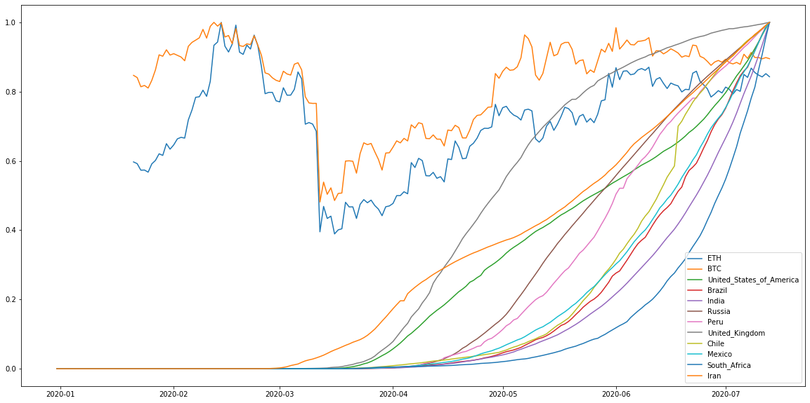

# Proyecto de Mineria de Datos #
## CodelCOVID-19##
### Analisis exploratorio de datos###

En este documento se realizará el analisis exploratorio de datos de dos tipos de dataset:
* Dataset de el valor de criptomoneda por fecha
* Dataset de cantidad de contagiados por dia de diferentes paises del mundo ordenados alfabeticamente

Todos los notebooks y codigos utilizados en el coducumento, se pueden encontrar en el repositorio:

<https://github.com/christiangfv/Proyecto_criptomonedas_covid19>

- Nicolas Calderon
- Christian Fuentes
- Oscar Guajardo

# Proyecto_criptomonedas_covid19

  Este repositorio está enfocado a contener el trabajo realizado como proyecto para la asignatura TEL - 354, Minería de Datos de la universidad Tecnica Federico Santa Maria, Valparaiso, Chile.
  
El objetivo de este proyecto es realizar un análisis que permita concluir la incidencia de la pandemia producida por COVID-19
en los valores de las criptomonedas más relevantes del mercado mundial, específicamente BitCoin y Ethereum.
  
  Se tienen 3 datasets, dos referentes a las criptomonedas que tienen por nombre BTC.xlsx y ETH.xlsx, y el dataset referente a
la información del COVID-19 que tiene por nombre dataset_covid.

Las columnas de dataset_covid son:

* dateRep : Conjunción de la fecha completa. (date)
* day : Dia. (int)
* month : Mes. (int)
* year  : Año. (int)
* cases : Cantidad de casos.  (int)
* deaths : Cantidad de muertes. (int)
* countriesAndTerritories: Nombre del país en cuestión. (string)
* geoId :  Código que representa a una entidad geográfica. (string)
* countryterritoryCode: Código correspondiente al país. (string)
* opData2019
* continentExp
* Cumulative_number_for_14_days_of_COVID-19_cases_per_100000
   
Las columnas de los datasets de criptomonedas son:

* Date : Fecha de la jornada. (date)
* Open : Valor que obtuvo la criptomoneda al abrir la jornada. (float)
* High : Valor máximo que obtuvo la criptomoneda al finalizar la jornada. (float)
* Low  : Valor mínimo que obtuvo la criptomoneda al finalizar la jornada. (float)
* Close : Valor con el que la moneda cerró la jornada.  (float)
* Volume : Número total de monedas negociadas en un valor durante la jornada. (int)
* Market Cap : Valor total en dolares de la totalidad de las criptomonedas. (int)


```python
import pandas as pd
import numpy as np
import matplotlib.pyplot as plt
```


```python
df_eth=pd.read_csv("dataset_eth.csv")
df_btc= pd.read_csv("dataset_btc.csv")
df_eth = df_eth.drop(0).reset_index(drop=True)
```

# Analisis de criptomonedas
### Etherium


```python
grafico_eth=plt.figure(figsize=(13,8))
plt.grid(True)
plt.title('Ethereum fecha v/s valor')
plt.plot(df_eth.index,df_eth['High'],c='r',alpha=0.4,label='High')
#plt.plot(df_eth.index,df_eth['Low'],c='b',alpha=0.4,)
plt.plot(df_eth.index,df_eth['Open'],c='y',alpha=0.4,label='Open')
plt.plot(df_eth.index,df_eth['Close'],c='g',alpha=0.4,label='Close')
plt.legend()
```


    <matplotlib.legend.Legend at 0x201c6fae308>


```python
grafico_eth_close=plt.figure(figsize=(10,7))
plt.grid(True)
plt.title('Ethereum fecha v/s valor Close')
plt.plot(df_eth.index,df_eth['Close'],c='g',alpha=0.4)
```


    [<matplotlib.lines.Line2D at 0x201c77d5f48>]


### BitCoin


```python
grafico_btc = plt.figure(figsize=(13,8))
plt.grid(True)
plt.title('Bitcoin fecha v/s valor')
plt.plot(df_btc.index,df_btc['High'],c='r',alpha=0.4,label='High')
#plt.plot(df_btc.index,df_btc['Low'],c='b',alpha=0.4,)
plt.plot(df_btc.index,df_btc['Close'],c='g',alpha=0.4,label='Close')
plt.plot(df_btc.index,df_btc['Open'],c='y',alpha=0.4,label='Open')
plt.legend()
```


    <matplotlib.legend.Legend at 0x201b8b1fe88>


```python
grafico_eth_close=plt.figure(figsize=(10,7))
plt.grid(True)
plt.title('Bitcoin fecha v/s valor Close')
plt.plot(df_btc.index,df_btc['Close'],c='g',alpha=0.4)
```


    [<matplotlib.lines.Line2D at 0x201c7c4ac08>]


Luego de analizar los valores entregados por la fuente de CoinMarketCap, decidimos estudiar el valor de la criptomoneda con el valor 'Close', esto debido a que es el valor de cierre por jornada resulta ser el más representativo de los cuatro.

# Analisis de datos para Covid19 #
## Contagios por Pais ##

Lo primero que se realiza es una preparación del dataset para un mejor manejo de los datos.


```python
fecha = pd.to_datetime(df_btc['Date'])
datetime_index = pd.DatetimeIndex(fecha.values) 
df_eth = df_eth.set_index(datetime_index).drop(['Date'],axis=1)
df_btc = df_btc.set_index(datetime_index).drop(['Date'],axis=1)

data_covid=pd.read_csv("dataset covid")

#Se genera la fecha en el formato de datetime
fecha=pd.to_datetime(data_covid["dateRep"],format="%d/%m/%Y")#"%d-%m-%Y")
#Se transforma a indice de tiempo los valores generados anteriormente
datetime_index = pd.DatetimeIndex(fecha.values) 
#Se setea como indice datetime_index
data_covid = data_covid.set_index(datetime_index)
#data_covid = data_covid.drop(columns=["dateRep"])
data_covid=data_covid.pivot(columns="countriesAndTerritories",values="cases").fillna(0)
#data_covid.iloc[0].max()
data_covid[data_covid<0]=0
data_covid.describe()
```


<div>
<style scoped>
    .dataframe tbody tr th:only-of-type {
        vertical-align: middle;
    }

    .dataframe tbody tr th {
        vertical-align: top;
    }

    .dataframe thead th {
        text-align: right;
    }
</style>
<table border="1" class="dataframe">
  <thead>
    <tr style="text-align: right;">
      <th>countriesAndTerritories</th>
      <th>Afghanistan</th>
      <th>Albania</th>
      <th>Algeria</th>
      <th>Andorra</th>
      <th>Angola</th>
      <th>Anguilla</th>
      <th>Antigua_and_Barbuda</th>
      <th>Argentina</th>
      <th>Armenia</th>
      <th>Aruba</th>
      <th>...</th>
      <th>United_States_Virgin_Islands</th>
      <th>United_States_of_America</th>
      <th>Uruguay</th>
      <th>Uzbekistan</th>
      <th>Venezuela</th>
      <th>Vietnam</th>
      <th>Western_Sahara</th>
      <th>Yemen</th>
      <th>Zambia</th>
      <th>Zimbabwe</th>
    </tr>
  </thead>
  <tbody>
    <tr>
      <th>count</th>
      <td>197.000000</td>
      <td>197.000000</td>
      <td>197.000000</td>
      <td>197.000000</td>
      <td>197.000000</td>
      <td>197.000000</td>
      <td>197.000000</td>
      <td>197.000000</td>
      <td>197.000000</td>
      <td>197.000000</td>
      <td>...</td>
      <td>197.000000</td>
      <td>197.000000</td>
      <td>197.000000</td>
      <td>197.000000</td>
      <td>197.000000</td>
      <td>197.000000</td>
      <td>197.000000</td>
      <td>197.000000</td>
      <td>197.000000</td>
      <td>197.000000</td>
    </tr>
    <tr>
      <th>mean</th>
      <td>174.898477</td>
      <td>18.126904</td>
      <td>99.944162</td>
      <td>4.355330</td>
      <td>2.568528</td>
      <td>0.015228</td>
      <td>0.375635</td>
      <td>523.375635</td>
      <td>163.203046</td>
      <td>0.532995</td>
      <td>...</td>
      <td>1.101523</td>
      <td>17071.350254</td>
      <td>5.020305</td>
      <td>70.416244</td>
      <td>49.274112</td>
      <td>1.893401</td>
      <td>3.862944</td>
      <td>7.604061</td>
      <td>9.619289</td>
      <td>5.248731</td>
    </tr>
    <tr>
      <th>std</th>
      <td>253.257431</td>
      <td>24.948501</td>
      <td>128.918033</td>
      <td>10.526722</td>
      <td>6.926850</td>
      <td>0.158988</td>
      <td>2.857324</td>
      <td>1084.289399</td>
      <td>249.991203</td>
      <td>2.064070</td>
      <td>...</td>
      <td>3.853152</td>
      <td>17003.135959</td>
      <td>7.208951</td>
      <td>116.257891</td>
      <td>92.475016</td>
      <td>4.217772</td>
      <td>25.649850</td>
      <td>15.432724</td>
      <td>30.948810</td>
      <td>13.522999</td>
    </tr>
    <tr>
      <th>min</th>
      <td>0.000000</td>
      <td>0.000000</td>
      <td>0.000000</td>
      <td>0.000000</td>
      <td>0.000000</td>
      <td>0.000000</td>
      <td>0.000000</td>
      <td>0.000000</td>
      <td>0.000000</td>
      <td>0.000000</td>
      <td>...</td>
      <td>0.000000</td>
      <td>0.000000</td>
      <td>0.000000</td>
      <td>0.000000</td>
      <td>0.000000</td>
      <td>0.000000</td>
      <td>0.000000</td>
      <td>0.000000</td>
      <td>0.000000</td>
      <td>0.000000</td>
    </tr>
    <tr>
      <th>25%</th>
      <td>0.000000</td>
      <td>0.000000</td>
      <td>0.000000</td>
      <td>0.000000</td>
      <td>0.000000</td>
      <td>0.000000</td>
      <td>0.000000</td>
      <td>0.000000</td>
      <td>0.000000</td>
      <td>0.000000</td>
      <td>...</td>
      <td>0.000000</td>
      <td>1.000000</td>
      <td>0.000000</td>
      <td>0.000000</td>
      <td>0.000000</td>
      <td>0.000000</td>
      <td>0.000000</td>
      <td>0.000000</td>
      <td>0.000000</td>
      <td>0.000000</td>
    </tr>
    <tr>
      <th>50%</th>
      <td>29.000000</td>
      <td>9.000000</td>
      <td>80.000000</td>
      <td>0.000000</td>
      <td>0.000000</td>
      <td>0.000000</td>
      <td>0.000000</td>
      <td>66.000000</td>
      <td>39.000000</td>
      <td>0.000000</td>
      <td>...</td>
      <td>0.000000</td>
      <td>19543.000000</td>
      <td>2.000000</td>
      <td>22.000000</td>
      <td>2.000000</td>
      <td>0.000000</td>
      <td>0.000000</td>
      <td>0.000000</td>
      <td>0.000000</td>
      <td>0.000000</td>
    </tr>
    <tr>
      <th>75%</th>
      <td>279.000000</td>
      <td>23.000000</td>
      <td>150.000000</td>
      <td>1.000000</td>
      <td>2.000000</td>
      <td>0.000000</td>
      <td>0.000000</td>
      <td>529.000000</td>
      <td>239.000000</td>
      <td>0.000000</td>
      <td>...</td>
      <td>0.000000</td>
      <td>26957.000000</td>
      <td>7.000000</td>
      <td>82.000000</td>
      <td>56.000000</td>
      <td>1.000000</td>
      <td>0.000000</td>
      <td>10.000000</td>
      <td>4.000000</td>
      <td>3.000000</td>
    </tr>
    <tr>
      <th>max</th>
      <td>1063.000000</td>
      <td>117.000000</td>
      <td>904.000000</td>
      <td>79.000000</td>
      <td>62.000000</td>
      <td>2.000000</td>
      <td>39.000000</td>
      <td>7267.000000</td>
      <td>1530.000000</td>
      <td>22.000000</td>
      <td>...</td>
      <td>36.000000</td>
      <td>66625.000000</td>
      <td>36.000000</td>
      <td>680.000000</td>
      <td>431.000000</td>
      <td>26.000000</td>
      <td>242.000000</td>
      <td>116.000000</td>
      <td>263.000000</td>
      <td>98.000000</td>
    </tr>
  </tbody>
</table>
<p>8 rows × 210 columns</p>
</div>


Luego de tener la data estandarizada como la necesitamos se procede a graficar.

## 10 Paises con mas contagiados
### Grafico acumulativo

Estas gráficas representan la cantidad de casos acumulativos en el tiempo para los países con más número de personas contagiadas de Covid-19.


```python
#Data de casos acumulativos
d=data_covid.cumsum()
#Ordenamiento de datos de mayor a menor, mediante el ultimo valor "index.values[-1]" 
max_val=d.sort_values(by=d.index.values[-1], axis=1,ascending=False)
#Extraccion de 10 paises con mayor cantidad de contagios acumulativos
paises_max=max_val.iloc[:,0:10]

#Extraccion de filas con 0
bool_df = (paises_max != 0).any(axis=1)
paises_max = paises_max.loc[bool_df]
paises_max.plot(figsize=(20,10))#grafico de contagios acumulativos por dia.
```


    <matplotlib.axes._subplots.AxesSubplot at 0x201c7e16548>


### Grafico de contagios por dia
Estas gráficas representan el número de casos por contagios que tiene cada día, en los 10 países con mayor número de ocurrencia de infectados con Covid-19.


```python
paises=list(paises_max.columns)
#paises.pop(7)#Se saca United_Kingdom por error tipografico en la informacion
data_contagios_diarios= data_covid[paises]
data_contagios_diarios.plot(figsize=(20,10))#grafico de contagios por dia
display(data_contagios_diarios.describe())
```


<div>
<style scoped>
    .dataframe tbody tr th:only-of-type {
        vertical-align: middle;
    }

    .dataframe tbody tr th {
        vertical-align: top;
    }

    .dataframe thead th {
        text-align: right;
    }
</style>
<table border="1" class="dataframe">
  <thead>
    <tr style="text-align: right;">
      <th>countriesAndTerritories</th>
      <th>United_States_of_America</th>
      <th>Brazil</th>
      <th>India</th>
      <th>Russia</th>
      <th>Peru</th>
      <th>United_Kingdom</th>
      <th>Chile</th>
      <th>Mexico</th>
      <th>South_Africa</th>
      <th>Iran</th>
    </tr>
  </thead>
  <tbody>
    <tr>
      <th>count</th>
      <td>197.000000</td>
      <td>197.000000</td>
      <td>197.000000</td>
      <td>197.000000</td>
      <td>197.000000</td>
      <td>197.000000</td>
      <td>197.000000</td>
      <td>197.000000</td>
      <td>197.000000</td>
      <td>197.000000</td>
    </tr>
    <tr>
      <th>mean</th>
      <td>17071.350254</td>
      <td>9568.360406</td>
      <td>4602.802030</td>
      <td>3724.360406</td>
      <td>1675.751269</td>
      <td>1626.314721</td>
      <td>1612.472081</td>
      <td>1545.355330</td>
      <td>1460.893401</td>
      <td>1318.030457</td>
    </tr>
    <tr>
      <th>std</th>
      <td>17003.135959</td>
      <td>13900.142279</td>
      <td>7277.881044</td>
      <td>4061.510489</td>
      <td>2067.507879</td>
      <td>1929.179429</td>
      <td>3143.620262</td>
      <td>2073.972085</td>
      <td>2892.319415</td>
      <td>1097.388997</td>
    </tr>
    <tr>
      <th>min</th>
      <td>0.000000</td>
      <td>0.000000</td>
      <td>0.000000</td>
      <td>0.000000</td>
      <td>0.000000</td>
      <td>0.000000</td>
      <td>0.000000</td>
      <td>0.000000</td>
      <td>0.000000</td>
      <td>0.000000</td>
    </tr>
    <tr>
      <th>25%</th>
      <td>1.000000</td>
      <td>0.000000</td>
      <td>0.000000</td>
      <td>0.000000</td>
      <td>0.000000</td>
      <td>0.000000</td>
      <td>0.000000</td>
      <td>0.000000</td>
      <td>0.000000</td>
      <td>0.000000</td>
    </tr>
    <tr>
      <th>50%</th>
      <td>19543.000000</td>
      <td>1146.000000</td>
      <td>601.000000</td>
      <td>954.000000</td>
      <td>181.000000</td>
      <td>820.000000</td>
      <td>325.000000</td>
      <td>260.000000</td>
      <td>93.000000</td>
      <td>1297.000000</td>
    </tr>
    <tr>
      <th>75%</th>
      <td>26957.000000</td>
      <td>16508.000000</td>
      <td>6654.000000</td>
      <td>7843.000000</td>
      <td>3527.000000</td>
      <td>3009.000000</td>
      <td>3012.000000</td>
      <td>2960.000000</td>
      <td>1218.000000</td>
      <td>2311.000000</td>
    </tr>
    <tr>
      <th>max</th>
      <td>66625.000000</td>
      <td>54771.000000</td>
      <td>28701.000000</td>
      <td>11656.000000</td>
      <td>8875.000000</td>
      <td>8719.000000</td>
      <td>36179.000000</td>
      <td>7280.000000</td>
      <td>13674.000000</td>
      <td>5275.000000</td>
    </tr>
  </tbody>
</table>
</div>


## Por Continente ##


```python
df_data_covid=pd.read_csv("dataset covid")

#Se genera la fecha en el formato de datetime
fecha=pd.to_datetime(df_data_covid["dateRep"],format="%d/%m/%Y")#"%d-%m-%Y")
#Se transforma a indice de tiempo los valores generados anteriormente
datetime_index = pd.DatetimeIndex(fecha.values) 
#Se setea como indice datetime_index
df_data_covid = df_data_covid[["continentExp","cases"]]
df_data_covid["date"]=fecha

data_continent=df_data_covid.groupby(["date","continentExp"]).sum()["cases"].unstack().fillna(0)data_continent
```


<div>
<style scoped>
    .dataframe tbody tr th:only-of-type {
        vertical-align: middle;
    }

    .dataframe tbody tr th {
        vertical-align: top;
    }

    .dataframe thead th {
        text-align: right;
    }
</style>
<table border="1" class="dataframe">
  <thead>
    <tr style="text-align: right;">
      <th>continentExp</th>
      <th>Africa</th>
      <th>America</th>
      <th>Asia</th>
      <th>Europe</th>
      <th>Oceania</th>
      <th>Other</th>
    </tr>
  </thead>
  <tbody>
    <tr>
      <th>count</th>
      <td>197.000000</td>
      <td>197.000000</td>
      <td>197.000000</td>
      <td>197.000000</td>
      <td>197.000000</td>
      <td>197.000000</td>
    </tr>
    <tr>
      <th>mean</th>
      <td>3105.614213</td>
      <td>34981.944162</td>
      <td>15031.705584</td>
      <td>13210.086294</td>
      <td>59.086294</td>
      <td>3.532995</td>
    </tr>
    <tr>
      <th>std</th>
      <td>4659.632330</td>
      <td>38181.317225</td>
      <td>16676.802056</td>
      <td>11593.374201</td>
      <td>115.587177</td>
      <td>16.422209</td>
    </tr>
    <tr>
      <th>min</th>
      <td>0.000000</td>
      <td>0.000000</td>
      <td>0.000000</td>
      <td>-14778.000000</td>
      <td>0.000000</td>
      <td>-9.000000</td>
    </tr>
    <tr>
      <th>25%</th>
      <td>0.000000</td>
      <td>1.000000</td>
      <td>1622.000000</td>
      <td>4.000000</td>
      <td>1.000000</td>
      <td>0.000000</td>
    </tr>
    <tr>
      <th>50%</th>
      <td>714.000000</td>
      <td>31337.000000</td>
      <td>10025.000000</td>
      <td>15248.000000</td>
      <td>13.000000</td>
      <td>0.000000</td>
    </tr>
    <tr>
      <th>75%</th>
      <td>4439.000000</td>
      <td>58175.000000</td>
      <td>23453.000000</td>
      <td>22027.000000</td>
      <td>50.000000</td>
      <td>0.000000</td>
    </tr>
    <tr>
      <th>max</th>
      <td>19128.000000</td>
      <td>143140.000000</td>
      <td>64865.000000</td>
      <td>37533.000000</td>
      <td>662.000000</td>
      <td>134.000000</td>
    </tr>
  </tbody>
</table>
</div>


### Grafica acumulativa

Graficas acumulativas por cada continente referente a los casos por contagio de Covd-19.


```python
data_continent_sum=data_continent.cumsum()
data_continent_sum.plot(figsize=(20,10))
```


    <matplotlib.axes._subplots.AxesSubplot at 0x201b83b96c8>


# Comparacion de Criptomonedas con Covid19

## 10 Paises con mas contagiados
Se analizan los 10 paises con mas contagios
### Grafico de casos acumulativo


```python
# Se estandarizan los dias para los dataframes
df_btc_eq = df_btc[:len(df_btc)-20]
df_eth_eq = df_eth[:len(df_eth)-20]
df_covid_eq = data_contagios_diarios[:-1].cumsum()

plt.figure(figsize=(20,10))

x_scaled_eth = df_eth_eq['Close'] / df_eth_eq['Close'].max() #Se normaliza la data
plt.plot(df_eth_eq.index,x_scaled_eth,label='ETH')

x_scaled_btc = df_btc_eq['Close'] / df_btc_eq['Close'].max() #Se normaliza la data
plt.plot(df_btc_eq.index,x_scaled_btc,label='BTC')

x_scaled_covid = df_covid_eq / df_covid_eq.max() #Se normaliza la data
for i in x_scaled_covid:
    plt.plot(df_covid_eq.index,x_scaled_covid[i],label=i)

plt.legend()
```


    <matplotlib.legend.Legend at 0x201b7ba0388>





### Grafico de casos por días


```python
# Se estandarizan los dias para los dataframes
df_btc_eq = df_btc[:len(df_btc)-20]
df_eth_eq = df_eth[:len(df_eth)-20]
df_covid_eq = data_contagios_diarios[:-1]

plt.figure(figsize=(30,500))

x_scaled_eth = df_eth_eq['Close'] / df_eth_eq['Close'].max() #Se normaliza la data


x_scaled_btc = df_btc_eq['Close'] / df_btc_eq['Close'].max() #Se normaliza la data


x_scaled_covid = df_covid_eq / df_covid_eq.max() #Se normaliza la data
j=1
for i in x_scaled_covid:
    ax=plt.subplot(len(df_covid_eq)/3,3,j)
    ax.plot(df_covid_eq.index,x_scaled_covid[i],label=i)
    ax.plot(df_eth_eq.index,x_scaled_eth,label='ETH')
    ax.plot(df_btc_eq.index,x_scaled_btc,label='BTC')
    ax.legend()
    j+=1

```


## Potencias Mundiales ##
Se procede a hacer un análisis de la potencias mundiales y los países que tienen mas uso de criptomonedas.

País (OrdenPotencia,MasUsoBitcoin)
- Estados Unidos (1, 2)
- Rusia (2,>5)
- China (3,>5)
- Alemania (4,>5)
- Reino Unido (5, 4)
- Francia (6,>5)
- Japon (7, 1)
- Corea del sur (10, 3)
- Dinamarca (>10, 5)

### Grafico de casos por días


```python
# Se estandarizan los dias para los dataframes
df_btc_eq = df_btc[:len(df_btc)-20]
df_eth_eq = df_eth[:len(df_eth)-20]
df_covid_eq = data_covid[21:-1][['United_States_of_America','Russia','China','Germany','United_Kingdom','France','Japan','South_Korea','Denmark']]

plt.figure(figsize=(30,500))

x_scaled_eth = df_eth_eq['Close'] / df_eth_eq['Close'].max() #Se normaliza la data


x_scaled_btc = df_btc_eq['Close'] / df_btc_eq['Close'].max() #Se normaliza la data


x_scaled_covid = df_covid_eq / df_covid_eq.max() #Se normaliza la data
j=1
for i in x_scaled_covid:
    ax=plt.subplot(len(df_covid_eq)/3,3,j)
    ax.set_title(i)
    ax.plot(df_covid_eq.index,x_scaled_covid[i],label=i)
    ax.plot(df_eth_eq.index,x_scaled_eth,label='ETH')
    ax.plot(df_btc_eq.index,x_scaled_btc,label='BTC')
    ax.legend()
    j+=1
```


Según estas gráficas, cuando Alemania, Reino Unido, Francia, Japón y Dinamarca se encuentran con el mayor número de contagios por días, es en el periodo donde el valor de la criptomoneda se encuentra en el valle de bajos valores de la criptomoneda.


```python
import seaborn as sns
df_btc_covid = df_covid_eq.join(df_btc_eq)
corrmat = df_btc_covid.corr()
top_feats = corrmat.index[abs(corrmat["Close"])>0.2]
g = sns.heatmap(df_btc_covid[top_feats].corr(),annot=True,cmap="seismic")
```


## Grafica con datos sin normalizar ##


```python
# Se estandarizan los dias para los dataframes
df_btc_eq = df_btc[:len(df_btc)-20]
df_eth_eq = df_eth[:len(df_eth)-20]
df_covid_eq = data_covid[21:-1][['United_States_of_America','Russia','China','Germany','United_Kingdom','France','Japan','South_Korea','Denmark']]

plt.figure(figsize=(20,10))

#x_scaled_eth = df_eth_eq['Close'] / df_eth_eq['Close'].max() #Se normaliza la data
#plt.plot(df_eth_eq.index,df_eth_eq['Close'],label='ETH')

#x_scaled_btc = df_btc_eq['Close'] / df_btc_eq['Close'].max() #Se normaliza la data

plt.plot(df_btc_eq.index,df_btc_eq['Close'],label='BTC',color='gold')


plt.ylim(0)
plt.legend()
#x_scaled_covid = df_covid_eq / df_covid_eq.max() #Se normaliza la data
ax2 = plt.twinx()

for i in df_covid_eq:
    ax2.plot(df_covid_eq.index,df_covid_eq[i],label=i,linestyle='--')

plt.legend()
```


    <matplotlib.legend.Legend at 0x201bdfe4908>


Se procede a analizar en mayor profundidad las gráficas de China y Dinamarca.

## China


```python
# Se estandarizan los dias para los dataframes
df_btc_eq = df_btc[:len(df_btc)-20]
df_eth_eq = df_eth[:len(df_eth)-20]
df_covid_eq = data_covid[21:-1][['China']]

plt.figure(figsize=(20,10))

#x_scaled_eth = df_eth_eq['Close'] / df_eth_eq['Close'].max() #Se normaliza la data
#plt.plot(df_eth_eq.index,df_eth_eq['Close'],label='ETH')

#x_scaled_btc = df_btc_eq['Close'] / df_btc_eq['Close'].max() #Se normaliza la data

plt.plot(df_btc_eq.index,df_btc_eq['Close'],label='BTC',color='gold')


plt.ylim(0)
plt.legend()
#x_scaled_covid = df_covid_eq / df_covid_eq.max() #Se normaliza la data
ax2 = plt.twinx()

for i in df_covid_eq:
    ax2.plot(df_covid_eq.index,df_covid_eq[i],label=i,linestyle='--')

plt.legend()
```


    <matplotlib.legend.Legend at 0x201be155408>


Se logra apreciar que cuando China tiene su número más alto de contagios en un día, es cuando comienza a bajar el valor de la Criptomoneda.
## Dinamarca


```python
# Se estandarizan los dias para los dataframes
df_btc_eq = df_btc[:len(df_btc)-20]
df_eth_eq = df_eth[:len(df_eth)-20]
df_covid_eq = data_covid[21:-1][['Denmark']]

plt.figure(figsize=(20,10))

#x_scaled_eth = df_eth_eq['Close'] / df_eth_eq['Close'].max() #Se normaliza la data
#plt.plot(df_eth_eq.index,df_eth_eq['Close'],label='ETH')

#x_scaled_btc = df_btc_eq['Close'] / df_btc_eq['Close'].max() #Se normaliza la data

plt.plot(df_btc_eq.index,df_btc_eq['Close'],label='BTC',color='gold')


plt.ylim(0)
plt.legend()
#x_scaled_covid = df_covid_eq / df_covid_eq.max() #Se normaliza la data
ax2 = plt.twinx()

for i in df_covid_eq:
    ax2.plot(df_covid_eq.index,df_covid_eq[i],label=i,linestyle='--')

plt.legend()
```


    <matplotlib.legend.Legend at 0x201be4cec48>


Dinamarca es uno de los países que más uso le está dando al Bitcoin, ya que es un país que está buscando eliminar el papel moneda, es por ello que las transacciones electrónicas se han ido generalizando.

Por otro lado, Dinamarca fue el primer país en el que se han llevado a cabo compras de bienes raíces utilizando Bitcoins.

Dinamarca es el quinto país en el mundo más amigable con las criptomonedas, y en la gráfica se logra apreciar cómo es que en el mismo día cuando Dinamarca tiene su primer peak en número de contagios, es cuando la criptomoneda tiene su baja más considerable. Para esta fecha que es el 2020-03-12 en Dinamarca se cerraron todas las escuelas y además sus fronteras.

##### Fuentes:
https://dortamartinez.com/ranking-de-los-paises-donde-mas-utilizan-bitcoin/ (5 paises con mas uso de criptomonedas)

https://www.nyidanmark.dk/en-GB/News%20Front%20Page/2020/03/us_lukket_til_27_marts (Cierre de fronteras en Dinamarca)

https://www.elconfidencial.com/mundo/europa/2020-03-12/avance-del-coronavirus-cierra-escuelas-por-toda-europa_2493543/ (Cierre de escuelas en Dinamarca)

# Prediccion del Valor del Bitcoin


```python
import pandas as pd
import numpy as np
import matplotlib.pyplot as plt
import sklearn
import torch
```

* Lo primero que se hará sera entrenar un modelo con datos de años anteriores de los valores de BTC y ETH, con el fin de predecir el valor que deberian haber tenido y compararlo con el valor verdadero.
    * El fin de esto es estimar cuanto dinero se perdio calculando el area entre curvas 


```python
######### Data Train BTC #############
df_BTC= pd.read_excel("BTC_Train_2.xlsx")
date=pd.to_datetime(df_BTC['Date'])
datetime_index = pd.DatetimeIndex(date.values)
df_BTC=df_BTC.set_index(datetime_index).drop(['Date'],axis=1)
#df_BTC.head()

######### Data Validation BTC #############
df_BTC_Validation= pd.read_excel("BTC_Validation.xlsx")
date=pd.to_datetime(df_BTC_Validation['Date'])
datetime_index = pd.DatetimeIndex(date.values)
df_BTC_Validation=df_BTC_Validation.set_index(datetime_index).drop(['Date'],axis=1)
#df_BTC_Validation.head()

######### Data Testing BTC #############
df_BTC_testing= pd.read_excel("BTC_Test.xlsx")
date=pd.to_datetime(df_BTC_testing['Date'])
datetime_index = pd.DatetimeIndex(date.values)
df_BTC_testing=df_BTC_testing.set_index(datetime_index).drop(['Date'],axis=1)
#df_BTC_testing.head()

######### Data Train ETH #############
df_ETH= pd.read_excel("ETH_Train.xlsx")
date=pd.to_datetime(df_ETH['Date'])
datetime_index = pd.DatetimeIndex(date.values)
df_ETH=df_ETH.set_index(datetime_index).drop(['Date'],axis=1)
#df_ETH.head()

######### Data Validation ETH #############
df_ETH_Validation= pd.read_excel("ETH_Validation.xlsx")
date=pd.to_datetime(df_ETH_Validation['Date'])
datetime_index = pd.DatetimeIndex(date.values)
df_ETH_Validation=df_ETH_Validation.set_index(datetime_index).drop(['Date'],axis=1)
#df_ETH_Validation.head()

######### Data Testing ETH #############
df_ETH_testing= pd.read_csv("dataset_eth.csv")
date=pd.to_datetime(df_ETH_testing['Date'])
datetime_index = pd.DatetimeIndex(date.values)
df_ETH_testing=df_ETH_testing.set_index(datetime_index).drop(['Date'],axis=1)
#df_ETH_testing.head()
```


```python
grafico_btc_close=plt.figure(figsize=(20,10))
plt.grid(True)
plt.title('Bitcoin fecha v/s valor Close')
plt.plot(df_BTC_testing.index,df_BTC_testing['Close'],c='g',alpha=0.4)
```


    [<matplotlib.lines.Line2D at 0x201c1152288>]


```python
grafico_eth_close=plt.figure(figsize=(20,10))
plt.grid(True)
plt.title('Ethereum fecha v/s valor Close')
plt.plot(df_ETH.index,df_ETH['Close'],c='g',alpha=0.4)

```


    [<matplotlib.lines.Line2D at 0x201c11a53c8>]


# Predicción de series de tiempo
## Procesamiento, Escalamiento y Transformacion de la data


```python
from sklearn.preprocessing import StandardScaler

df_btc_train=df_BTC
df_btc_val=df_BTC_Validation
df_btc_test=df_BTC_testing

scaler = StandardScaler()
train_arr = scaler.fit_transform(df_btc_train[["Close"]].values)
val_arr = scaler.transform(df_btc_val[["Close"]].values)
test_arr = scaler.transform(df_btc_test[["Close"]].values)
```


```python
def transform_data(arr, seq_len):
    x, y = [], []
    for i in range(len(arr) - seq_len):
        x_i = arr[i : i + seq_len]
        y_i = arr[i + 1 : i + seq_len + 1]
        x.append(x_i)
        y.append(y_i)
    x_arr = np.array(x).reshape(-1, seq_len)
    y_arr = np.array(y).reshape(-1, seq_len)
    x_var = Variable(torch.from_numpy(x_arr).float())
    y_var = Variable(torch.from_numpy(y_arr).float())
    return x_var, y_var
```


```python
from torch.autograd import Variable

seq_len = 100

x_train, y_train = transform_data(train_arr, seq_len)
x_val, y_val = transform_data(val_arr, seq_len)
x_test, y_test = transform_data(test_arr, seq_len)
```


```python
def plot_sequence(axes, i, x_train, y_train):
    axes[i].set_title("%d. Sequence" % (i + 1))
    axes[i].set_xlabel("Time Bars")
    axes[i].set_ylabel("Scaled Close Price")
    axes[i].plot(range(seq_len), x_train[i].cpu().numpy(), color="r", label="Feature")
    axes[i].plot(range(1, seq_len + 1), y_train[i].cpu().numpy(), color="b", label="Target")
    axes[i].legend()
```

Como vimos a lo largo del curso, cuando intentamos hacer una regresion o clasificacion, tenemos un conjunto de features o caracteristicas y un objetivo que queremos predecir.

Para este caso ambos son el precio de cierre de jornada de bitcoin


```python
fig, axes = plt.subplots(nrows=1, ncols=2, figsize=(14, 7))
plot_sequence(axes, 0, x_train, y_train)
plot_sequence(axes, 1, x_train, y_train)
```


### Redes neuronales recursivas

Las Redes Neuronales Recursivas (RNN) estan especializadas para captar secuencias (Cosas que pasan en el tiempo una tras de otra).

* La red neuronal tiene bloques y cada bloque tiene una entrada y una salida.

* Los bloques estan conectados unos con otros, hasta que el ultimo bloque es el que predice.

* Ademas Sobre los bloques se pueden hacer capas que ayuden a predecir de mejor manera. Mientras mas bloques se predice con mayor precision. Estos bloques van haciendo predicciones en base a la probabilidad de que un valor especifico se genere luego de el valor en el que nos encontramos.
    * Mientras mas capas de neuronas se generen, mayor sera la red de probabilidades y tambien su complejidad.

* Estas redes tienen memoria a corto plazo, esto quiere decir que predicen mejor en menor cantidad de bloques.

Para mejorar esto se utiliza *LSTM (Long Short Term Memory Neural Network)*

## Long Short Term Memory Neural Network

Las LSTM recuerdan datos relevantes en la secuencia y preservarlo por un periodo de tiempo, por lo que puede funcionar tanto a corto plazo como a largo plazo. Esto lo hace mediante una celda de estado en la cual se pueden añadir o eliminar datos que se quieren mantener o sacar de una red neuronal


```python
import torch.nn as nn
import torch.optim as optim


class Model(nn.Module):
    def __init__(self, input_size, hidden_size, output_size):
        super(Model, self).__init__()
        self.input_size = input_size
        self.hidden_size = hidden_size
        self.output_size = output_size
        self.lstm = nn.LSTMCell(self.input_size, self.hidden_size)
        self.linear = nn.Linear(self.hidden_size, self.output_size)

    def forward(self, input, future=0, y=None):
        outputs = []

        # reset the state of LSTM
        # the state is kept till the end of the sequence
        h_t = torch.zeros(input.size(0), self.hidden_size, dtype=torch.float32)
        c_t = torch.zeros(input.size(0), self.hidden_size, dtype=torch.float32)

        for i, input_t in enumerate(input.chunk(input.size(1), dim=1)):
            h_t, c_t = self.lstm(input_t, (h_t, c_t))
            output = self.linear(h_t)
            outputs += [output]

        for i in range(future):
            if y is not None and random.random() > 0.5:
                output = y[:, [i]]  # teacher forcing
            h_t, c_t = self.lstm(output, (h_t, c_t))
            output = self.linear(h_t)
            outputs += [output]
        outputs = torch.stack(outputs, 1).squeeze(2)
        return outputs
```


```python
import time
import random

class Optimization:
    """ A helper class to train, test and diagnose the LSTM"""

    def __init__(self, model, loss_fn, optimizer, scheduler):
        self.model = model
        self.loss_fn = loss_fn
        self.optimizer = optimizer
        self.scheduler = scheduler
        self.train_losses = []
        self.val_losses = []
        self.futures = []

    @staticmethod
    def generate_batch_data(x, y, batch_size):
        for batch, i in enumerate(range(0, len(x) - batch_size, batch_size)):
            x_batch = x[i : i + batch_size]
            y_batch = y[i : i + batch_size]
            yield x_batch, y_batch, batch

    def train(
        self,
        x_train,
        y_train,
        x_val=None,
        y_val=None,
        batch_size=100,
        n_epochs=15,
        do_teacher_forcing=None,
    ):
        seq_len = x_train.shape[1]
        for epoch in range(n_epochs):
            start_time = time.time()
            self.futures = []

            train_loss = 0
            for x_batch, y_batch, batch in self.generate_batch_data(x_train, y_train, batch_size):
                y_pred = self._predict(x_batch, y_batch, seq_len, do_teacher_forcing)
                self.optimizer.zero_grad()
                loss = self.loss_fn(y_pred, y_batch)
                loss.backward()
                self.optimizer.step()
                train_loss += loss.item()
            self.scheduler.step()
            train_loss /= batch
            self.train_losses.append(train_loss)

            self._validation(x_val, y_val, batch_size)

            elapsed = time.time() - start_time
            print(
                "Epoch %d Train loss: %.2f. Validation loss: %.2f. Avg future: %.2f. Elapsed time: %.2fs."
                % (epoch + 1, train_loss, self.val_losses[-1], np.average(self.futures), elapsed)
            )

    def _predict(self, x_batch, y_batch, seq_len, do_teacher_forcing):
        if do_teacher_forcing:
            future = random.randint(1, int(seq_len) / 2)
            limit = x_batch.size(1) - future
            y_pred = self.model(x_batch[:, :limit], future=future, y=y_batch[:, limit:])
        else:
            future = 0
            y_pred = self.model(x_batch)
        self.futures.append(future)
        return y_pred

    def _validation(self, x_val, y_val, batch_size):
        if x_val is None or y_val is None:
            return
        with torch.no_grad():
            val_loss = 0
            batch = 1
            for x_batch, y_batch, batch in self.generate_batch_data(x_val, y_val, batch_size):
                y_pred = self.model(x_batch)
                loss = self.loss_fn(y_pred, y_batch)
                val_loss += loss.item()
            val_loss /= batch
            self.val_losses.append(val_loss)

    def evaluate(self, x_test, y_test, batch_size, future=1):
        with torch.no_grad():
            test_loss = 0
            actual, predicted = [], []
            for x_batch, y_batch, batch in self.generate_batch_data(x_test, y_test, batch_size):
                y_pred = self.model(x_batch, future=future)
                y_pred = (
                    y_pred[:, -len(y_batch) :] if y_pred.shape[1] > y_batch.shape[1] else y_pred
                )
                loss = self.loss_fn(y_pred, y_batch)
                test_loss += loss.item()
                actual += torch.squeeze(y_batch[:, -1]).data.cpu().numpy().tolist()
                predicted += torch.squeeze(y_pred[:, -1]).data.cpu().numpy().tolist()
            test_loss /= batch
            return actual, predicted, test_loss

    def plot_losses(self):
        plt.plot(self.train_losses, label="Training loss")
        plt.plot(self.val_losses, label="Validation loss")
        plt.legend()
        plt.title("Losses")
```


```python
def generate_sequence(scaler, model, x_sample, future=332):
    """ Generate future values for x_sample with the model """
    y_pred_tensor = model(x_sample, future=future)
    y_pred = y_pred_tensor.cpu().tolist()
    y_pred = scaler.inverse_transform(y_pred)
    return y_pred
```


```python
def to_dataframe(actual, predicted):
    return pd.DataFrame({"actual": actual, "predicted": predicted})


def inverse_transform(scalar, df, columns):
    for col in columns:
        df[col] = scaler.inverse_transform(df[col])
    return df
```

## Entrenando la LSTM

Se entrena la LSTM con 18 hidden-unities, que son los bloques LSTM. Elegir un numero menor de hidden-unities es utilizado para que sea menos posible que la LSTM memorice perfectamente la secuencia 


```python
model_1 = Model(input_size=1, hidden_size=18, output_size=1)
loss_fn_1 = nn.MSELoss()
optimizer_1 = optim.Adam(model_1.parameters(), lr=1e-2)
scheduler_1 = optim.lr_scheduler.StepLR(optimizer_1, step_size=5, gamma=0.1)
optimization_1 = Optimization(model_1, loss_fn_1, optimizer_1, scheduler_1)
```


```python
optimization_1.train(x_train, y_train, x_val, y_val, do_teacher_forcing=False)
```

    Epoch 1 Train loss: 0.43. Validation loss: 1.82. Avg future: 0.00. Elapsed time: 0.90s.
    Epoch 2 Train loss: 0.17. Validation loss: 0.51. Avg future: 0.00. Elapsed time: 0.90s.
    Epoch 3 Train loss: 0.11. Validation loss: 0.33. Avg future: 0.00. Elapsed time: 1.06s.
    Epoch 4 Train loss: 0.11. Validation loss: 0.79. Avg future: 0.00. Elapsed time: 0.95s.
    Epoch 5 Train loss: 0.10. Validation loss: 0.46. Avg future: 0.00. Elapsed time: 0.79s.
    Epoch 6 Train loss: 0.07. Validation loss: 0.41. Avg future: 0.00. Elapsed time: 0.85s.
    Epoch 7 Train loss: 0.06. Validation loss: 0.35. Avg future: 0.00. Elapsed time: 0.94s.
    Epoch 8 Train loss: 0.06. Validation loss: 0.30. Avg future: 0.00. Elapsed time: 0.94s.
    Epoch 9 Train loss: 0.05. Validation loss: 0.26. Avg future: 0.00. Elapsed time: 0.94s.
    Epoch 10 Train loss: 0.05. Validation loss: 0.22. Avg future: 0.00. Elapsed time: 0.92s.
    Epoch 11 Train loss: 0.05. Validation loss: 0.22. Avg future: 0.00. Elapsed time: 0.93s.
    Epoch 12 Train loss: 0.05. Validation loss: 0.22. Avg future: 0.00. Elapsed time: 0.92s.
    Epoch 13 Train loss: 0.05. Validation loss: 0.21. Avg future: 0.00. Elapsed time: 0.86s.
    Epoch 14 Train loss: 0.05. Validation loss: 0.21. Avg future: 0.00. Elapsed time: 0.86s.
    Epoch 15 Train loss: 0.05. Validation loss: 0.21. Avg future: 0.00. Elapsed time: 0.97s.
    


```python
optimization_1.plot_losses()
```


Para evaluar el modelo de pruebas, se establece el parametro future en 5 barras de tiempo (que en nuestro caso es 5 dias), lo que significa que la salida de cada bloque del modelo mostraria donde cree que estaria el valor del precio en 5 dias más.


```python
actual_1, predicted_1, test_loss_1 = optimization_1.evaluate(x_test, y_test, future=5, batch_size=100)
df_result_1 = to_dataframe(actual_1, predicted_1) 
df_result_1 = inverse_transform(scaler, df_result_1, ['actual', 'predicted'])
df_result_1.plot(figsize=(14, 7))
print("Test loss %.4f" % test_loss_1)
```

    Test loss 0.6545
    


```python
fig, axes = plt.subplots(nrows=1, ncols=2, figsize=(14, 7))
df_result_1.iloc[0:200].plot(ax=axes[0], figsize=(14, 7))
df_result_1.iloc[200:400].plot(ax=axes[1], figsize=(14, 7))
```


    <matplotlib.axes._subplots.AxesSubplot at 0x201c1493088>


```python
x_sample = x_test[0].reshape(1, -1)
y_sample = df_btc_test[["Close"]].values
 
y_pred1 = generate_sequence(scaler, optimization_1.model, x_sample)
```


```python
plt.figure(figsize=(14, 7))
plt.plot(range(100), y_pred1[0][:100], color="blue", lw=2, label="Predicted Close Price")
plt.plot(range(100, 432), y_pred1[0][100:], "--", color="blue", lw=2, label="Generated Close Price")
plt.plot(range(0, 432), y_sample, color="red", label="Actual Close Price")
plt.legend()
```


    <matplotlib.legend.Legend at 0x201c1603e48>


El comportamiento anterior podría ocurrir porque el modelo fue entrenado sólo con entradas verdaderas y nunca con entradas generadas. Cuando el modelo se alimenta de la salida generada en la entrada, hace un mal trabajo al generar los siguientes valores. El *Teacher Forcing* es un concepto que trata este tema.

## Teacher Forcing

El *Teacher Forcing* es un metodo para entrenar RNN, que utilizan como entrada la salida de un bloque LSTM anterior. Esto permite que la secuencia sea mas precisa, pero tambien puede hacer menos estable el modelo y no converger.

Para realizar *Teacher forcing* se utilizara Scheduled sampling, que es una extension de *Teacher Forcing*. El modelo utilizará su salida generada como una entrada con una cierta probabilidad durante el entrenamiento. Al principio, la probabilidad de que un modelo vea su salida generada es pequeña y luego aumenta gradualmente durante el entrenamiento.


```python
model_2 = Model(input_size=1, hidden_size=21, output_size=1)
loss_fn_2 = nn.MSELoss()
optimizer_2 = optim.Adam(model_2.parameters(), lr=1e-2)
scheduler_2 = optim.lr_scheduler.StepLR(optimizer_2, step_size=5, gamma=1)
optimization_2 = Optimization(model_2, loss_fn_2,  optimizer_2, scheduler_2)
```


```python
optimization_2.train(x_train, y_train, x_val, y_val, do_teacher_forcing=True)
```

    Epoch 1 Train loss: 0.49. Validation loss: 2.68. Avg future: 18.33. Elapsed time: 0.84s.
    Epoch 2 Train loss: 0.29. Validation loss: 1.63. Avg future: 27.44. Elapsed time: 0.83s.
    Epoch 3 Train loss: 0.20. Validation loss: 0.55. Avg future: 25.78. Elapsed time: 0.80s.
    Epoch 4 Train loss: 0.18. Validation loss: 1.12. Avg future: 32.78. Elapsed time: 0.78s.
    Epoch 5 Train loss: 0.14. Validation loss: 0.98. Avg future: 28.44. Elapsed time: 0.80s.
    Epoch 6 Train loss: 0.12. Validation loss: 0.47. Avg future: 23.44. Elapsed time: 0.81s.
    Epoch 7 Train loss: 0.08. Validation loss: 0.20. Avg future: 30.33. Elapsed time: 0.81s.
    Epoch 8 Train loss: 0.07. Validation loss: 0.22. Avg future: 30.67. Elapsed time: 1.11s.
    Epoch 9 Train loss: 0.05. Validation loss: 0.17. Avg future: 20.33. Elapsed time: 1.12s.
    Epoch 10 Train loss: 0.05. Validation loss: 0.08. Avg future: 21.44. Elapsed time: 0.95s.
    Epoch 11 Train loss: 0.04. Validation loss: 0.05. Avg future: 18.78. Elapsed time: 1.13s.
    Epoch 12 Train loss: 0.03. Validation loss: 0.07. Avg future: 24.56. Elapsed time: 0.93s.
    Epoch 13 Train loss: 0.03. Validation loss: 0.03. Avg future: 30.00. Elapsed time: 0.87s.
    Epoch 14 Train loss: 0.02. Validation loss: 0.11. Avg future: 27.89. Elapsed time: 0.92s.
    Epoch 15 Train loss: 0.02. Validation loss: 0.05. Avg future: 22.00. Elapsed time: 1.04s.
    


```python
optimization_2.plot_losses()
```


```python
actual_2, predicted_2, test_loss_2 = optimization_2.evaluate(x_test, y_test, batch_size=100, future=5)
df_result_2 = to_dataframe(actual_2, predicted_2)
df_result_2 = inverse_transform(scaler, df_result_2, ["actual", "predicted"])
df_result_2.plot(figsize=(14, 7))
print("Test loss %.4f" % test_loss_2)
```

    Test loss 0.0616
    


```python
fig, axes = plt.subplots(nrows=1, ncols=2, figsize=(14, 7))
df_result_2.iloc[0:150].plot(ax=axes[0], figsize=(14, 7))
df_result_2.iloc[150:332].plot(ax=axes[1], figsize=(14, 7))
```


    <matplotlib.axes._subplots.AxesSubplot at 0x201c33efc08>


```python
y_pred2 = generate_sequence(scaler, optimization_2.model, x_sample)
```


```python
plt.figure(figsize=(14, 7))
plt.plot(range(100), y_pred2[0][:100], color="blue", lw=2, label="Predicted Close Price")
plt.plot(range(100, 432), y_pred2[0][100:], "--", color="blue", lw=2, label="Generated Close Price")
plt.plot(range(0, 432), y_sample, color="red", label="Actual Close Price")
plt.legend()
```


    <matplotlib.legend.Legend at 0x201c34b0648>


La secuencia generada a partir del modelo entrenado con *Teacher Forcing* necesita más tiempo para converger. Otra observación sobre la secuencia generada es que cuando está aumentando, continuará aumentando hasta algún punto, luego comenzará a disminuir y el patrón se repetirá hasta que la secuencia converja.
